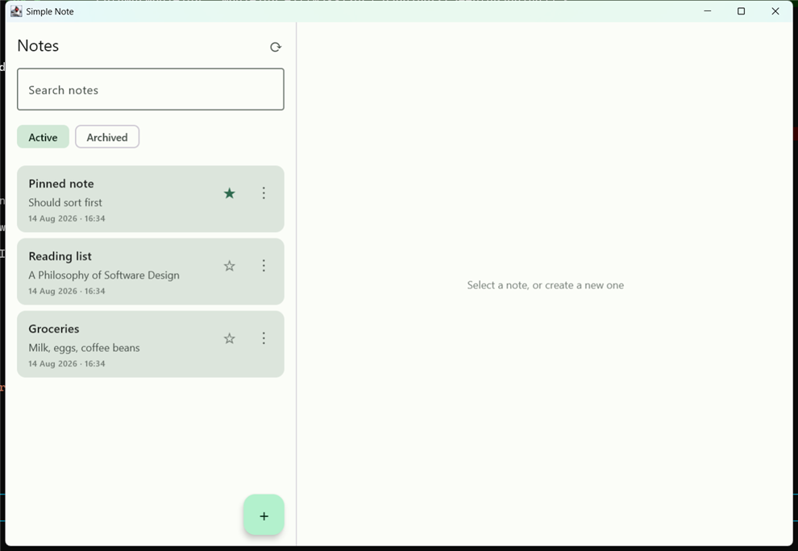

# Simple Note

A cross-platform note application: a **Kotlin Multiplatform** client sharing one Compose UI
across Android, iOS and desktop, talking to a **Kotlin + Spring Boot** REST backend over
**MySQL/MariaDB**.

No authentication — the API is open by design for this first version.



---

## Contents

- [What it does](#what-it-does)
- [Architecture](#architecture)
- [Technology stack](#technology-stack)
- [Project structure](#project-structure)
- [Getting started](#getting-started)
  - [1. Database](#1-database)
  - [2. Backend](#2-backend)
  - [3. Client](#3-client)
- [Configuring the backend URL](#configuring-the-backend-url)
- [API reference](#api-reference)
- [Testing](#testing)
- [Architectural decisions](#architectural-decisions)
- [Known limitations](#known-limitations)

---

## What it does

Create, read, edit and delete notes; search titles and content; pin notes to the top of the
list; archive notes out of the way and restore them. Notes carry creation and modification
timestamps. Loading, empty, error and network-failure states are all handled explicitly.

The UI adapts to the window: below 840dp it shows one screen at a time; at or above 840dp it
shows the list and the editor side by side. That covers phone, tablet, iPad and desktop from
a single implementation, and a desktop window switches layout live as it is resized.

---

## Architecture

Both sides follow the same rule: **the domain layer depends on nothing**, and every other
layer points inward at it. The domain declares interfaces (ports); outer layers implement
them (adapters).

### Backend

```
presentation (REST)  ──▶  application (use cases)  ──▶  domain (model + ports)
                                                            ▲
infrastructure (JPA / MySQL) ───────────────────────────────┘  implements NoteRepository
```

| Layer | Contains | Knows about |
|---|---|---|
| `domain` | `Note`, `NewNote`, `NoteRepository` port, `DomainException` | Nothing. No Spring, no JPA. |
| `application` | 8 use cases, commands | The domain only |
| `infrastructure` | `NoteEntity`, Spring Data repository, `NoteRepositoryAdapter`, `Clock` bean | The domain + JPA |
| `presentation` | `NoteController`, DTOs, `GlobalExceptionHandler` | The application + HTTP |

### Client

```
presentation (Compose + MVI)  ──▶  domain (model + use cases + port)
                                        ▲
data (Ktor + DTOs) ────────────────────┘  implements NoteRepository
```

MVI: the UI sends **Intents**, the store reduces them into **State**, and one-shot things
(snackbars, navigation) leave as **Effects**. State is durable and replays correctly after a
rotation or resize; effects fire exactly once.

### Data flow, end to end

```
Compose  ──onIntent(PinChanged)──▶  NotesListViewModel
                                          │  optimistic state update
                                          ▼
                                    SetNotePinnedUseCase
                                          ▼
                              NoteRepository (domain port)
                                          ▼
                              NoteRepositoryImpl ──▶ NoteApi ──▶ Ktor
                                          │                        │
                                          │                    HTTP PATCH
                                          ▼                        ▼
                              AppResult<Note>            NoteController
                                          │                        ▼
                                          │              SetNotePinnedUseCase
                                          │                        ▼
                                          │              NoteRepositoryAdapter
                                          │                        ▼
                                          │                   MySQL / MariaDB
                                          ▼
                     StateFlow<NotesListState> ──▶ recomposition
                     Channel<Effect>           ──▶ snackbar / navigation
```

Failures never cross layers as exceptions. The data layer catches every throwable at its
boundary and converts it to an `AppError`; everything above works with
`AppResult<T> = Success | Failure(AppError)`, so the compiler forces each failure to be
handled.

---

## Technology stack

**Client** — Kotlin 2.4.10, Compose Multiplatform 1.11.1, Ktor 3.5.2 (OkHttp on
Android/desktop, Darwin on iOS), kotlinx-serialization 1.11.0, kotlinx-coroutines 1.11.0,
kotlinx-datetime 0.8.0, Koin 4.2.2, AGP 9.0.1.

**Backend** — Kotlin 2.3.21, Spring Boot 4.1.0 (`starter-webmvc`, `starter-data-jpa`,
`starter-validation`), Jackson 3, Hibernate 7, Java 17, MySQL Connector/J + MariaDB JDBC 3.5.10.

**Testing** — kotlin.test, kotlinx-coroutines-test, Ktor MockEngine, JUnit 6, MockMvc,
mockito-kotlin 6.3.0, H2 2.4.240.

---

## Project structure

```
simple-note/
├── note-backend/                       Spring Boot backend
│   ├── db/schema.sql                   run this in phpMyAdmin first
│   ├── db/seed.sql                     optional sample notes
│   └── src/main/kotlin/com/arunrk/note_backend/
│       ├── domain/                     model, repository port, exceptions
│       ├── application/                use cases + commands
│       ├── infrastructure/             JPA entity, adapter, Clock config
│       └── presentation/rest/          controller, DTOs, exception handler
│
└── SimpleNote/                         Kotlin Multiplatform client
    ├── androidApp/                     Android entry point + manifest
    ├── desktopApp/                     desktop entry point
    ├── iosApp/                         Xcode project
    └── shared/src/
        ├── commonMain/kotlin/com/arunrk/simplenote/
        │   ├── core/                   AppResult, AppError, MviViewModel
        │   ├── domain/                 model, repository port, use cases
        │   ├── data/                   DTOs, mappers, NoteApi, repository impl
        │   ├── network/                Ktor client config, ApiConfig
        │   ├── presentation/           MVI stores + Compose screens
        │   └── di/                     Koin modules
        ├── androidMain/                OkHttp engine, 10.0.2.2 base URL
        ├── iosMain/                    Darwin engine, view controller
        ├── jvmMain/                    OkHttp engine, desktop base URL
        └── commonTest/                 shared tests for all targets
```

> **Note on source set names.** The brief sketched a `desktopMain` source set. This project
> declares its desktop target as `jvm()`, so the idiomatic name is **`jvmMain`**. Renaming the
> target would break `desktopApp/build.gradle.kts`, so `jvmMain` is kept.

---

## Getting started

> Prefer a formatted, step-by-step version with copyable commands and a troubleshooting
> section? Open **[`RUNNING.html`](RUNNING.html)** in a browser.

### Prerequisites

- **JDK 17+**
- **MySQL 8** or **MariaDB 10.4+** (XAMPP includes MariaDB)
- **Android Studio** for the Android app, **Xcode on a Mac** for iOS

### 1. Database

Start MySQL/MariaDB, then run [`note-backend/db/schema.sql`](note-backend/db/schema.sql) once.

**Via phpMyAdmin** — open <http://localhost/phpmyadmin>, go to the **SQL** tab, paste the
contents of `schema.sql`, and run it. It creates the `simple_note` database and the `notes`
table.

**Via the command line:**

```bash
mysql -u root -p < note-backend/db/schema.sql
```

Optionally load sample notes with `note-backend/db/seed.sql`.

The schema:

```sql
CREATE TABLE notes (
  id          BIGINT       NOT NULL AUTO_INCREMENT,
  title       VARCHAR(255) NOT NULL DEFAULT '',
  content     TEXT         NOT NULL,
  is_pinned   BOOLEAN      NOT NULL DEFAULT FALSE,
  is_archived BOOLEAN      NOT NULL DEFAULT FALSE,
  created_at  DATETIME(6)  NOT NULL,       -- UTC
  updated_at  DATETIME(6)  NOT NULL,       -- UTC
  PRIMARY KEY (id),
  KEY idx_notes_list (is_archived, is_pinned, updated_at),
  CONSTRAINT chk_notes_not_empty CHECK (TRIM(title) <> '' OR TRIM(content) <> '')
) ENGINE = InnoDB DEFAULT CHARSET = utf8mb4 COLLATE = utf8mb4_unicode_ci;
```

`idx_notes_list` matches the default query exactly — filter on `is_archived`, then read out in
`is_pinned DESC, updated_at DESC` order via a backward index scan, with no filesort. The
columns are ascending on purpose: MariaDB before 10.8 parses `DESC` in an index definition and
silently ignores it, so declaring it would produce different indexes on MariaDB and MySQL 8.

The backend boots with `spring.jpa.hibernate.ddl-auto=validate`, so it **refuses to start** if
the entity mapping and this table ever drift apart.

### 2. Backend

```bash
cd note-backend
./gradlew bootRun
```

It listens on <http://localhost:8080>.

**Configuration** is entirely through environment variables — no credential is hardcoded, and
the defaults match a stock XAMPP install:

| Variable | Default | Notes |
|---|---|---|
| `DB_URL` | `jdbc:mariadb://localhost:3306/simple_note?connectionTimeZone=UTC&characterEncoding=utf8` | See below for MySQL |
| `DB_USERNAME` | `root` | |
| `DB_PASSWORD` | *(empty)* | |
| `SERVER_PORT` | `8080` | |

```bash
DB_PASSWORD=secret ./gradlew bootRun
```

**MySQL vs MariaDB.** XAMPP ships **MariaDB** even though its control panel says "MySQL".
Both drivers are on the runtime classpath and the JDBC URL scheme picks one, so switching is a
single environment variable:

```bash
# MySQL 8
DB_URL='jdbc:mysql://localhost:3306/simple_note?connectionTimeZone=UTC&characterEncoding=utf8' ./gradlew bootRun
```

This matters: MariaDB reports its version as `5.5.5-10.4.32-MariaDB`, and MySQL Connector/J
reads that prefix as version **5.5.5** — Hibernate then generates SQL for a 2010-era server.
Using the MariaDB driver for MariaDB avoids that.

### 3. Client

Start the backend first, then:

```bash
cd SimpleNote

./gradlew :desktopApp:run          # Desktop — fastest way to see it working
./gradlew :androidApp:installDebug # Android device or emulator
```

**iOS**: open `SimpleNote/iosApp/iosApp.xcodeproj` in Xcode and run. Requires a Mac.

---

## Configuring the backend URL

Each platform has a default that works out of the box for local development:

| Platform | Default | Why |
|---|---|---|
| Android emulator | `http://10.0.2.2:8080` | The emulator's alias for the host's loopback. `localhost` there means the emulated device itself. |
| iOS Simulator | `http://localhost:8080` | The simulator shares the Mac's network stack. |
| Desktop | `http://localhost:8080` | Same machine. |

To point at something else — a physical device on your LAN, or a staging server — pass a base
URL when starting Koin:

```kotlin
initKoin(baseUrl = "http://192.168.1.20:8080")
```

- **Android**: `NoteApplication.onCreate()` in `androidApp/src/main/kotlin/.../NoteApplication.kt`
- **Desktop**: `main()` in `desktopApp/src/main/kotlin/.../main.kt`
- **iOS**: `MainViewController()` in `shared/src/iosMain/kotlin/.../MainViewController.kt`

**Plain HTTP is allowed only for local development hosts.** Android permits cleartext to
`10.0.2.2`, `localhost` and `127.0.0.1` via
[`network_security_config.xml`](SimpleNote/androidApp/src/main/res/xml/network_security_config.xml);
iOS permits it for `localhost` only via an ATS exception in `Info.plist`. Both were scoped
narrowly rather than allowing cleartext globally, so pointing this app at a real server still
requires HTTPS. **Add your LAN address to both files** when testing on a physical device.

---

## API reference

Base path `/api/notes`. All bodies are JSON; all timestamps are ISO-8601 UTC.

| Method | Path | Success | Errors |
|---|---|---|---|
| `GET` | `/api/notes?archived=false` | 200 `[Note]` | — |
| `GET` | `/api/notes/search?query=milk&archived=false` | 200 `[Note]` | 400 |
| `GET` | `/api/notes/{id}` | 200 `Note` | 404 |
| `POST` | `/api/notes` | 201 + `Location` | 400 |
| `PUT` | `/api/notes/{id}` | 200 `Note` | 400, 404 |
| `DELETE` | `/api/notes/{id}` | 204 | 404 |
| `PATCH` | `/api/notes/{id}/pin` | 200 `Note` | 400, 404 |
| `PATCH` | `/api/notes/{id}/archive` | 200 `Note` | 400, 404 |

Lists are always sorted pinned-first, then most recently updated. `archived` defaults to
`false`.

### Create

```bash
curl -i -X POST localhost:8080/api/notes \
  -H 'Content-Type: application/json' \
  -d '{"title":"Groceries","content":"Milk, eggs"}'
```

```http
HTTP/1.1 201 Created
Location: /api/notes/1
```
```json
{
  "id": 1,
  "title": "Groceries",
  "content": "Milk, eggs",
  "pinned": false,
  "archived": false,
  "createdAt": "2026-08-14T09:53:42.651589Z",
  "updatedAt": "2026-08-14T09:53:42.651589Z"
}
```

Both `title` and `content` are optional, but **at least one must be non-blank**. `title` is
capped at 255 characters, `content` at 65,535.

### Pin and archive

These take the desired value rather than toggling, which makes them idempotent — a retried
request cannot flip a note to the opposite of what the user asked for.

```bash
curl -X PATCH localhost:8080/api/notes/1/pin \
  -H 'Content-Type: application/json' -d '{"pinned":true}'

curl -X PATCH localhost:8080/api/notes/1/archive \
  -H 'Content-Type: application/json' -d '{"archived":true}'
```

Archiving a note also unpins it.

### Search

```bash
curl 'localhost:8080/api/notes/search?query=milk'
```

Case-insensitive substring match over title and content. `%` and `_` are matched literally,
not as wildcards. A blank query is rejected with 400 rather than returning the whole table.

### Errors

Every non-2xx response uses one envelope, produced by a single `@RestControllerAdvice`:

```json
{
  "status": 404,
  "error": "NOTE_NOT_FOUND",
  "message": "Note not found with id 9999",
  "path": "/api/notes/9999",
  "timestamp": "2026-08-14T09:53:56.800718400Z"
}
```

`fieldErrors` is present **only** for per-field validation failures:

```json
{
  "status": 400,
  "error": "VALIDATION_FAILED",
  "message": "The request contains invalid fields",
  "path": "/api/notes",
  "timestamp": "2026-08-14T09:53:57.056403500Z",
  "fieldErrors": { "title": "Title must be at most 255 characters" }
}
```

Branch on `error` (stable machine-readable code), not `message` (human-facing, may be
reworded).

| `error` | Status | Meaning |
|---|---|---|
| `NOTE_NOT_FOUND` | 404 | No note with that id |
| `INVALID_NOTE` | 400 | Business rule violated (e.g. note is entirely blank) |
| `INVALID_SEARCH_QUERY` | 400 | Blank search query |
| `VALIDATION_FAILED` | 400 | Field constraint violated; see `fieldErrors` |
| `MALFORMED_REQUEST_BODY` | 400 | Body missing, unparseable, or missing a required field |
| `INVALID_PARAMETER` | 400 | Path or query parameter of the wrong type |
| `MISSING_PARAMETER` | 400 | Required query parameter absent |
| `ENDPOINT_NOT_FOUND` | 404 | No such path |
| `METHOD_NOT_ALLOWED` | 405 | Wrong HTTP method |
| `INTERNAL_ERROR` | 500 | Unexpected failure; details are logged, never returned |

---

## Testing

```bash
cd note-backend && ./gradlew test     # 84 tests
cd SimpleNote    && ./gradlew :shared:jvmTest   # 108 tests
```

**Backend (84)** — use cases against a hand-written in-memory fake; persistence through
`@DataJpaTest` on H2 in MySQL mode; the REST layer through `@WebMvcTest` + MockMvc covering
every status code and the error envelope.

**Client (108)** — use cases against a fake repository; the data layer through Ktor's
`MockEngine`, exercising the **real production client configuration** so serialization,
timeouts and error mapping are what actually ship; MVI stores with `kotlinx-coroutines-test`
covering loading, error, search debounce, and optimistic pin with rollback.

Run everything for one target:

```bash
cd SimpleNote && ./gradlew :shared:allTests
```

The `iosSimulatorArm64Test` task is reported as disabled on Windows and Linux — simulator
tests require macOS.

---

## Architectural decisions

Full records are in [`docs/adr/`](docs/adr/). The short version:

| Decision | Why |
|---|---|
| Separate `Note` (persisted) and `NewNote` (not yet persisted) | No nullable id and no `!!` anywhere. |
| Domain model separate from JPA entity and from DTOs | The DB schema and the wire format evolve independently; JPA needs mutability, the domain stays immutable. |
| `Clock` injected into use cases | Timestamps become a testable input, not a hidden DB side effect. |
| Concrete use cases, no interface per class | The seams that matter are persistence and network; an interface per use case is ceremony. |
| `AppResult`/`AppError` instead of exceptions above the data layer | Failures become part of the type signature, so they cannot be forgotten. |
| Pin/archive take a value, not a toggle | Idempotent; two devices cannot flip a note back and forth. |
| `LIKE` search, not `FULLTEXT` | Predictable for short and partial queries. Swap in `FULLTEXT` if the table grows large. |
| `schema.sql` + `ddl-auto=validate`, no Flyway | The schema is reviewable DDL you run in phpMyAdmin, and drift fails the boot loudly. |
| Adaptive layout via `BoxWithConstraints`, no navigation library | Two destinations, both on screen at once above 840dp — a poor fit for a back stack. |
| Text glyphs instead of `material-icons-extended` | A large dependency for a handful of shapes. |

### Designed to extend

The structure leaves room for the features that were deliberately **not** built:

- **Authentication** — add a Ktor auth plugin in `network/`, Spring Security in the backend.
  No use case or screen changes.
- **Offline-first / sync** — add a local data source and a second `NoteRepository`
  implementation. Nothing above the data layer changes, because it only knows the port.
- **Tags, categories, attachments** — new domain models and use cases alongside the existing
  ones; the layering already isolates the blast radius.
- **Rich text** — the editor is one screen behind a state object.

---

## Known limitations

Stated plainly, so nothing here is a surprise:

- **iOS is compiled but not run.** Both `iosArm64` and `iosSimulatorArm64` targets compile,
  and the iOS source sets follow standard KMP conventions — but this project was developed on
  Windows, so the iOS app has never been launched. Expect to fix small Xcode-side issues on
  first build.
- **Hibernate 7 warns that MariaDB 10.4 is below its 10.6 minimum.** Everything this app uses
  works; a newer MariaDB (or MySQL 8) clears the warning.
- **No pagination.** `GET /api/notes` returns every note in the bucket. Fine at personal-notes
  scale, not at ten thousand.
- **No authentication.** The API is fully open, as specified. Do not expose it to a network
  you do not control.
- **H2 stands in for MySQL in persistence tests**, so they verify the queries and the adapter,
  not the production DDL. Booting against real MySQL with `ddl-auto=validate` is what verifies
  `schema.sql`.
